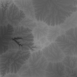
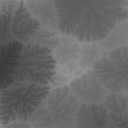
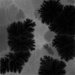

This is a terrain generator that simulates terrain due to hydraulic erosion,
mostly following the paper "Large-scale Terrain Authoring through Interactive Erosion Simulation" (https://doi.org/10.1145/3592787).

 

The GPU code uses an explicit time integrator and taichi's GUI. For stability it is sufficient to have dt < max sqrt(1/a) <= 1/N. 
The CPU code uses an implicit time integrator and prints images to out/. Both code uses pyvista for the final visualization.
Shown below is a comparison:

Timestep | Implicit             |  Explicit
:--------:|:-------------------------:|:-------------------------:
Small |  | 
Large |  | 

A back of the envelope calculation suggests that if there is a single pit (local minimum), 
the ratio of the average height lost due to erosion compared to the maximum height difference is k / sqrt(N) 
where k is a constant usually smaller than 1 (for example 1/sqrt(2) or 32/105). 
Curiously, this number often out fairly accurate even for N up to 1024. 
Thus for the terrain to keep its height, the uplift should be scaled by this factor compared to the initial height.
In the code k = 0.4. 